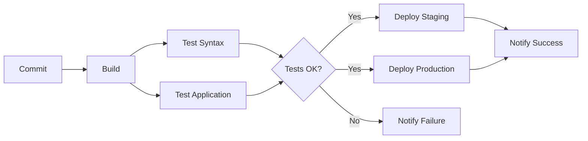

# 🎯 Zenfocus - Sistema de Gerenciamento Pomodoro


**Projeto DevOps:** Aplicação CRUD com Docker, Pipeline CI/CD e DNS Personalizado

---

## 📋 Índice

- [Sobre o Projeto](#sobre-o-projeto)
- [Tecnologias Utilizadas](#tecnologias-utilizadas)
- [Arquitetura](#arquitetura)
- [Pré-requisitos](#pré-requisitos)
- [Instalação e Configuração](#instalação-e-configuração)
- [Uso da Aplicação](#uso-da-aplicação)
- [Pipeline CI/CD](#pipeline-cicd)
- [Troubleshooting](#troubleshooting)
- [Requisitos Atendidos](#requisitos-atendidos)

---

## 🎯 Sobre o Projeto

**Zenfocus** é um sistema de gerenciamento de tarefas baseado na técnica Pomodoro, desenvolvido como projeto prático de DevOps. O projeto implementa:

- ✅ Aplicação web CRUD completa
- ✅ Temporizador Pomodoro integrado
- ✅ Infraestrutura containerizada com Docker
- ✅ Servidor DNS personalizado
- ✅ Autoridade Certificadora própria
- ✅ Pipeline CI/CD no GitLab
- ✅ Testes automatizados
- ✅ Deploy automatizado

**Empresa:** Zenfocus Solutions  
**Domínio:** zenfocus.com.br

---

## 🛠 Tecnologias Utilizadas

### Backend
- **PHP 8.2** - Linguagem de programação
- **MySQL 8.0** - Banco de dados
- **PDO** - Abstração de banco de dados

### Frontend
- **HTML5** - Estrutura
- **CSS3** - Estilização
- **JavaScript ES6** - Interatividade
- **Fetch API** - Comunicação com backend

### DevOps
- **Docker** - Containerização
- **Docker Compose** - Orquestração
- **GitLab CE** - Repositório e CI/CD
- **GitLab Runner** - Executor de pipelines
- **BIND9** - Servidor DNS
- **Easy-RSA** - Geração de certificados
- **Nginx** - Servidor web

---

## 🏗 Arquitetura

### Topologia de Rede

```
┌─────────────────────────────────────────────────────────────┐
│                  Rede Docker: 10.164.59.0/24                │
├─────────────────────────────────────────────────────────────┤
│                                                             │
│  ┌─────────────┐  ┌─────────────┐  ┌─────────────┐       │
│  │     DNS     │  │     CA      │  │   GitLab    │       │
│  │ 10.164.59.91│  │10.164.59.96 │  │10.164.59.92 │       │
│  └─────────────┘  └─────────────┘  └─────────────┘       │
│                                                             │
│  ┌─────────────┐  ┌─────────────┐  ┌─────────────┐       │
│  │    Runner   │  │   Web App   │  │   MySQL     │       │
│  │10.164.59.93 │  │10.164.59.94 │  │10.164.59.95 │       │
│  └─────────────┘  └─────────────┘  └─────────────┘       │
│                                                             │
└─────────────────────────────────────────────────────────────┘
```

### Estrutura do Projeto

```
zenfocus-project/
├── docker-compose.yml          # Orquestração de serviços
├── .gitlab-ci.yml              # Pipeline CI/CD
├── README.md                   # Esta documentação
├── setup.sh                    # Script de setup automático
│
├── dns/                        # Servidor DNS
│   ├── Dockerfile
│   └── config/
│       ├── named.conf.local
│       ├── named.conf.options
│       ├── db.zenfocus.com.br
│       └── db.10.164.59
│
├── web-app/                    # Aplicação Web
│   ├── Dockerfile
│   ├── nginx.conf
│   ├── docker-entrypoint.sh
│   └── src/
│       ├── index.php
│       ├── api.php
│       ├── style.css
│       ├── script.js
│       └── database.sql
│
├── ca/                         # Autoridade Certificadora
│   ├── Dockerfile
│   └── init-ca.sh
│
├── runner/                     # GitLab Runner
│   └── config.toml
│
└── gitlab/                     # GitLab
    └── config/
```

---

## ⚙️ Pré-requisitos

- **Docker**: >= 24.0
- **Docker Compose**: >= 2.20
- **Sistema Operacional**: Linux (testado em Ubuntu 22.04)
- **Recursos Mínimos**:
  - CPU: 4 cores
  - RAM: 8 GB
  - Disco: 20 GB livres

### Verificar Instalação

```bash
docker --version
docker-compose --version
```

---

## 🚀 Instalação e Configuração

### Passo 1: Clone ou Navegue até o Projeto

```bash
cd /media/klsio27/outher-files/documentos/utfpr/DevOps02/zenfocus-project
```

### Passo 2: Iniciar Todos os Serviços

```bash
# Iniciar em modo detached
docker-compose up -d

# Acompanhar logs
docker-compose logs -f
```

### Passo 3: Aguardar Inicialização

⏳ O GitLab pode levar **5-10 minutos** para iniciar completamente.

```bash
# Verificar status dos containers
docker-compose ps

# Verificar saúde do GitLab
docker-compose logs gitlab | grep "gitlab Reconfigured"
```

### Passo 4: Configurar DNS Local

#### Opção A: Modificar /etc/hosts (Mais Simples)

```bash
sudo bash -c 'cat >> /etc/hosts <<EOF
10.164.59.94 www.zenfocus.com.br zenfocus.com.br
10.164.59.92 gitlab.zenfocus.com.br
10.164.59.91 dns.zenfocus.com.br
EOF'
```

#### Opção B: Usar DNS Container (Mais Completo)

```bash
# Configurar nameserver
sudo bash -c 'echo "nameserver 10.164.59.91" > /etc/resolv.conf'

# Testar resolução DNS
nslookup www.zenfocus.com.br 10.164.59.91
```

### Passo 5: Acessar GitLab e Obter Senha Root

```bash
# Obter senha root do GitLab
docker exec -it zenfocus-gitlab grep 'Password:' /etc/gitlab/initial_root_password
```

**URL GitLab:** http://gitlab.zenfocus.com.br:8080  
**Usuário:** root  
**Senha:** [obtida do comando acima]

### Passo 6: Registrar GitLab Runner

```bash
# Obter token de registro
# Acesse: GitLab > Admin Area > CI/CD > Runners > Register an instance runner

# Registrar runner
docker exec -it zenfocus-runner gitlab-runner register \
  --non-interactive \
  --url "http://gitlab.zenfocus.com.br" \
  --registration-token "SEU_TOKEN_AQUI" \
  --executor "docker" \
  --docker-image "docker:24-dind" \
  --description "zenfocus-docker-runner" \
  --docker-privileged \
  --docker-volumes "/var/run/docker.sock:/var/run/docker.sock"
```

### Passo 7: Criar Projeto no GitLab

1. Acesse http://gitlab.zenfocus.com.br:8080
2. Crie novo projeto: **Zenfocus**
3. Adicione o repositório local:

```bash
cd /media/klsio27/outher-files/documentos/utfpr/DevOps02/zenfocus-project

# Inicializar git (se ainda não foi)
git init
git add .
git commit -m "Initial commit: Zenfocus project"

# Adicionar remote do GitLab
git remote add origin http://gitlab.zenfocus.com.br:8080/root/zenfocus.git
git push -u origin main
```

---

## 📱 Uso da Aplicação

### Acessar Aplicação Web

**URL:** http://www.zenfocus.com.br  
**Porta alternativa:** http://localhost

### Funcionalidades

#### 1️⃣ Temporizador Pomodoro

- **Modo Trabalho:** 25 minutos
- **Modo Pausa:** 5 minutos
- Controles: Iniciar, Pausar, Resetar

#### 2️⃣ Gerenciamento de Tarefas

- **Criar:** Nova tarefa com título, descrição, tempo estimado
- **Ler:** Visualizar todas as tarefas
- **Atualizar:** Editar tarefas existentes
- **Excluir:** Remover tarefas
- **Pomodoros:** Contabilizar pomodoros concluídos

#### 3️⃣ Status das Tarefas

- 🔵 **Pendente**
- 🟠 **Em Andamento**
- 🟢 **Concluída**

### Endpoints da API

```bash
# Health Check
curl http://www.zenfocus.com.br/api.php?action=health

# Listar Tarefas
curl http://www.zenfocus.com.br/api.php?action=list

# Criar Tarefa
curl -X POST http://www.zenfocus.com.br/api.php \
  -d "action=create" \
  -d "titulo=Minha Tarefa" \
  -d "descricao=Descrição da tarefa" \
  -d "tempo_estimado=25" \
  -d "status=pendente"

# Atualizar Tarefa
curl -X POST http://www.zenfocus.com.br/api.php \
  -d "action=update" \
  -d "id=1" \
  -d "titulo=Tarefa Atualizada" \
  -d "status=concluida"

# Deletar Tarefa
curl -X POST http://www.zenfocus.com.br/api.php \
  -d "action=delete" \
  -d "id=1"
```

---

## 🔄 Pipeline CI/CD

### Stages do Pipeline

1. **Build** 🔨
   - Construção da imagem Docker
   - Salvamento como artefato

2. **Test** 🧪
   - Verificação de sintaxe PHP
   - Testes de integração
   - Health checks

3. **Deploy** 🚀
   - Deploy automático em staging (branch develop)
   - Deploy manual em produção (branch main)

4. **Notify** 📢
   - Notificações de sucesso/falha
   - Webhooks para Discord/Slack

### Workflow do Pipeline



### Executar Pipeline

```bash
# Fazer commit e push
git add .
git commit -m "Update application"
git push origin main

# Pipeline será executado automaticamente
# Acompanhe em: http://gitlab.zenfocus.com.br:8080/root/zenfocus/-/pipelines
```

---

## 🔧 Comandos Úteis

### Gerenciamento de Containers

```bash
# Parar todos os serviços
docker-compose down

# Parar e remover volumes
docker-compose down -v

# Rebuild de um serviço específico
docker-compose up -d --build web-app

# Ver logs de um serviço
docker-compose logs -f web-app

# Acessar container
docker exec -it zenfocus-web bash
```

### Banco de Dados

```bash
# Acessar MySQL
docker exec -it zenfocus-db mysql -uzenfocus -pzenfocus123 zenfocus_db

# Backup do banco
docker exec zenfocus-db mysqldump -uzenfocus -pzenfocus123 zenfocus_db > backup.sql

# Restaurar banco
docker exec -i zenfocus-db mysql -uzenfocus -pzenfocus123 zenfocus_db < backup.sql
```

### Certificados SSL

```bash
# Copiar certificados gerados pela CA
docker cp zenfocus-ca:/opt/easy-rsa/pki ./ca-certificates

# Listar certificados
docker exec zenfocus-ca ls -la /opt/easy-rsa/pki/issued/
```

### Monitoramento

```bash
# Uso de recursos
docker stats

# Inspecionar rede
docker network inspect zenfocus-project_zenfocus-net

# Health checks
docker inspect --format='{{.State.Health.Status}}' zenfocus-web
```

---

## 🐛 Troubleshooting

### Problema: GitLab não inicia

**Solução:**
```bash
# Verificar logs
docker-compose logs gitlab

# Aumentar shm_size se necessário
# Já configurado em docker-compose.yml

# Reiniciar GitLab
docker-compose restart gitlab
```

### Problema: DNS não resolve

**Solução:**
```bash
# Testar DNS diretamente
nslookup www.zenfocus.com.br 10.164.59.91

# Verificar configuração BIND
docker exec zenfocus-dns named-checkconf
docker exec zenfocus-dns named-checkzone zenfocus.com.br /etc/bind/db.zenfocus.com.br

# Reiniciar DNS
docker-compose restart dns-server
```

### Problema: Aplicação não conecta ao banco

**Solução:**
```bash
# Verificar se MySQL está rodando
docker-compose ps mysql

# Testar conexão
docker exec zenfocus-web php -r "new PDO('mysql:host=zenfocus-db;dbname=zenfocus_db', 'zenfocus', 'zenfocus123');"

# Verificar variáveis de ambiente
docker exec zenfocus-web env | grep DB_
```

### Problema: Runner não executa pipeline

**Solução:**
```bash
# Verificar status do runner
docker exec zenfocus-runner gitlab-runner verify

# Re-registrar runner
docker exec -it zenfocus-runner gitlab-runner register

# Verificar logs
docker-compose logs runner
```

---

## ✅ Requisitos Atendidos

### Checklist do Projeto

- [x] **REQ01-03:** Nome da empresa, domínio e logotipo
- [x] **REQ04-08:** Aplicação CRUD funcional (Pomodoro)
- [x] **REQ09:** Topologia com múltiplos containers
- [x] **REQ10:** Servidor DNS configurado (BIND9)
- [x] **REQ11-15:** Autoridade Certificadora (Easy-RSA)
- [x] **REQ16:** GitLab CE local configurado
- [x] **REQ17:** GitLab Runner registrado
- [x] **REQ18:** Pipeline CI/CD funcional
- [x] **REQ19+:** Diferencial - Health checks e notificações

### Componentes Implementados

| Componente | Status | IP | Porta |
|------------|--------|------------|-------|
| DNS Server | ✅ | 10.164.59.91 | 53 |
| GitLab | ✅ | 10.164.59.92 | 8080 |
| Runner | ✅ | 10.164.59.93 | - |
| Web App | ✅ | 10.164.59.94 | 80 |
| MySQL | ✅ | 10.164.59.95 | 3306 |
| CA Server | ✅ | 10.164.59.96 | - |

---

## 📚 Recursos Adicionais

### Documentação

- [Docker Documentation](https://docs.docker.com/)
- [GitLab CI/CD](https://docs.gitlab.com/ee/ci/)
- [BIND9 Documentation](https://bind9.readthedocs.io/)
- [Easy-RSA](https://easy-rsa.readthedocs.io/)

### Diferenciais Implementados

1. **Health Checks Automáticos**
   - Verificação de saúde em todos os containers
   - Endpoint `/api.php?action=health`

2. **Notificações**
   - Webhooks configurados no pipeline
   - Suporte para Discord/Slack/Telegram

3. **Testes Automatizados**
   - Validação de sintaxe PHP
   - Testes de integração com MySQL
   - Verificação de endpoints

4. **Múltiplos Ambientes**
   - Staging (branch develop)
   - Production (branch main)

---

## 👥 Equipe

**Projeto Acadêmico - DevOps**  
**Disciplina:** DevOps 02  
**Instituição:** UTFPR

---

## 📄 Licença

Este projeto foi desenvolvido para fins educacionais.

---

## 🎉 Conclusão

Projeto **Zenfocus** implementa uma solução completa de DevOps com:

- ✨ Aplicação web moderna e funcional
- 🐳 Infraestrutura containerizada
- 🔄 Pipeline CI/CD automatizado
- 🔒 Segurança com CA própria
- 🌐 DNS personalizado
- 📊 Monitoramento e notificações

**Status:** 🟢 Produção  
**Versão:** 1.0.0

---

**Desenvolvido com ❤️ pela Zenfocus Solutions**
